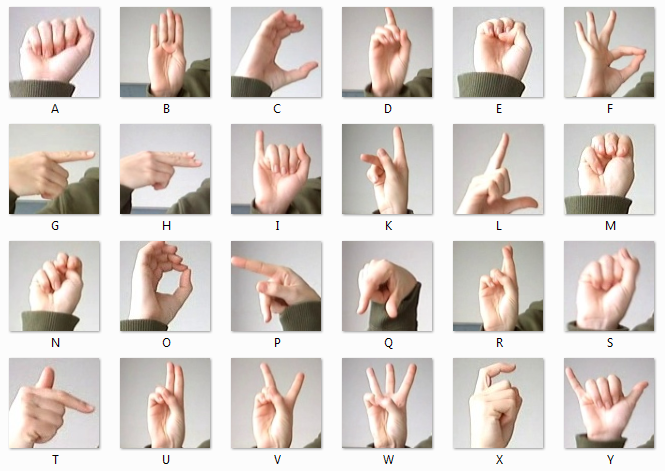
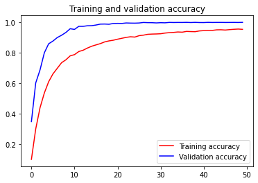
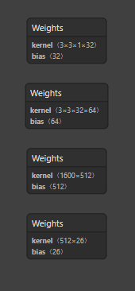
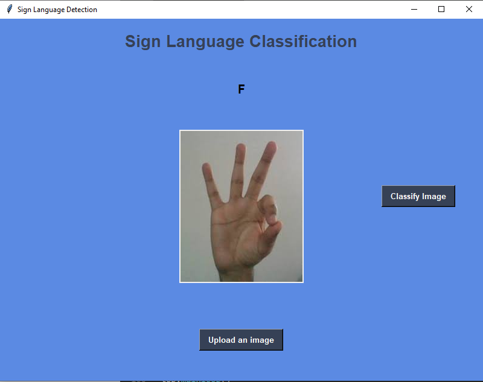
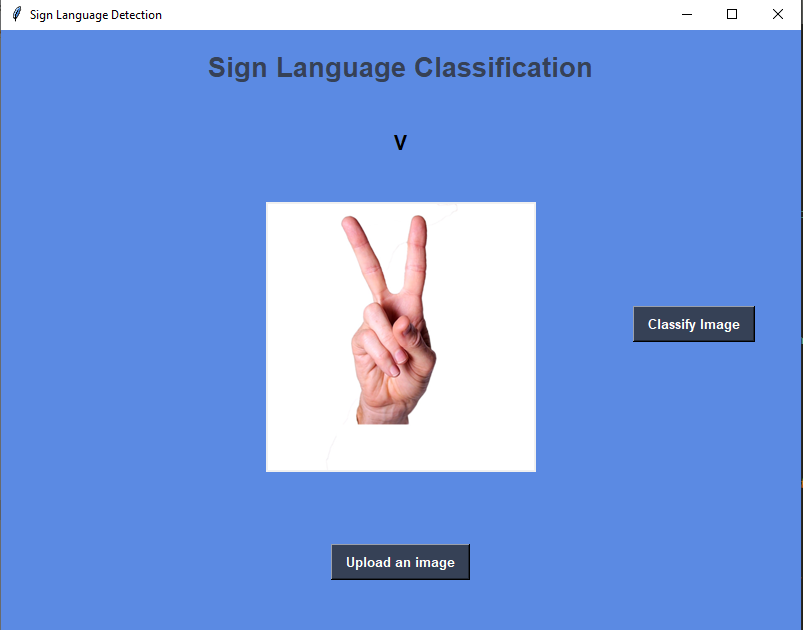
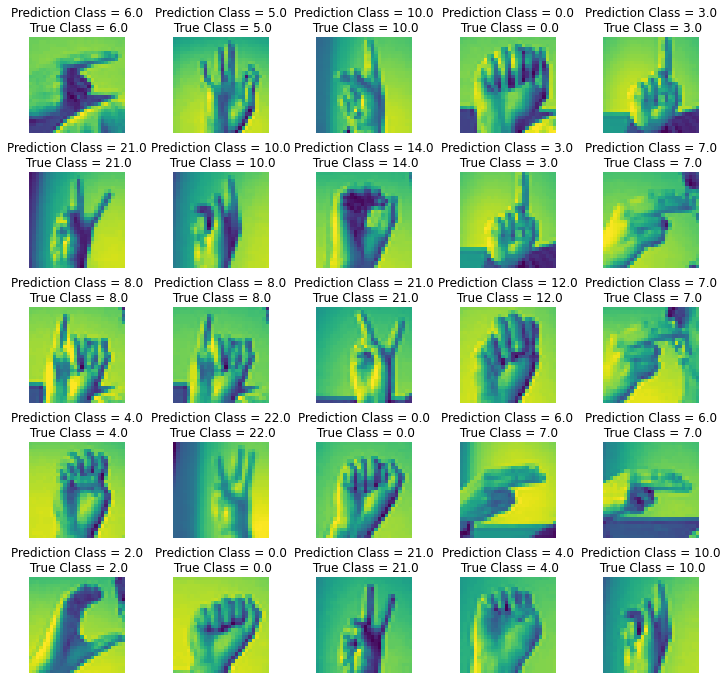

# Sign-Language-Detection

## 1. Introduction

American Sign Language (ASL) is a complete, natural language that has the same linguistic properties as spoken languages, with grammar that differs from English. ASL is expressed by movements of the hands and face. It is the primary language of many North Americans who are deaf and hard of hearing, and is used by many hearing people as well.
The dataset format is patterned to match closely with the classic MNIST. Each training and test case represents a label (0-25) as a one-to-one map for each alphabetic letter A-Z (and no cases for 9=J or 25=Z because of gesture motions). The training data (27,455 cases) and test data (7172 cases) are approximately half the size of the standard MNIST but otherwise similar with a header row of label, pixel1,pixel2….pixel784 which represent a single 28x28 pixel image with grayscale values between 0-255. The original hand gesture image data represented multiple users repeating the gesture against different backgrounds. The Sign Language MNIST data came from greatly extending the small number (1704) of the color images included as not cropped around the hand region of interest. To create new data, an image pipeline was used based on ImageMagick and included cropping to hands-only, gray-scaling, resizing, and then creating at least 50+ variations to enlarge the quantity.

## 2. Data 
Dataset has been downloaded from kaggle.
You can find it [here](https://www.kaggle.com/datamunge/sign-language-mnist).

## 3. Requirements
You can do it also in Google Colab. 
tensorflow 2.0.0
python 3.6
Other versions may work. I have done with this requirements for the compatibility with my gpu.

## 4. Loading the dataset,Data Augmentation and Training
Both the train and test data set are in .csv format.I also did data augmentation to reduce overfitting.
Here is my training and validation accuracy curve.

## 5. Model Structure
I have tried some parameter tuning. But i found a nice test set accuracy of about 97% with simple CNN model 

## 6. Saving the model
I have saved the model in two files.(.h5 and .json)

## 7. Creating the Gui Using Tkinter
I have uploaded the file. Run and Enjoy!
 

## 8. Thoughts about accuracy and improvement
Though test set accuracy is fine enough, but It may not work well on all images. One reason can be that the dataset is not vey rich. I tried by capturing some images. It was not predicting as accurate as test set.

